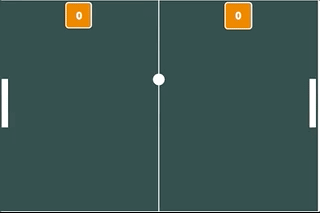

# Game Classic Pong Ball

<h2>The famous classic game Pong Ball by JavaScript</h2>

## Project description
    Starting my studies in programming with the online school Alura, in my first module of "Beginner Training in Programming" the challenge was to create the classic Pong Ball game from scratch. Using JavaScript on the p5js.org platform, together with the teacher, we created step by step the entire structure of the game, the visual plan, the movement of the ball and racketes, the contact physics, the score, and ambient sound.

Below the gif with the preview of the final project

    

    It is also possible to interact with the game, through the link below, when starting the browser, the game will start automatically and you can control your racket using the UP and Down arrows (you may need to click on the game to recognize the commands)

### Access link to the final project
https://editor.p5js.org/DevZilio/full/zKChTT6Py

### Acces link to edition mode
https://editor.p5js.org/DevZilio/sketches/zKChTT6Py

After finishing this project, I decided to improve and create my own version, in the link below access to the second project made from this one:

(link do github a gerar)

## Author

[ DevZilio](https://github.com/DevZilio)